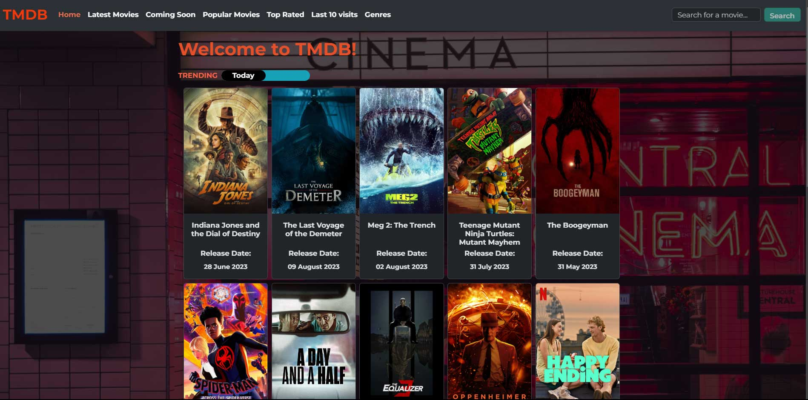

# :movie_camera: TMDB Movie App :clapper

Welcome to the TMDB Movie App! This is a web application that allows users to explore and discover movies from The Movie Database (TMDB).

## Table of Contents

- [Features](#features)
- [Getting Started](#getting-started)
  - [Prerequisites](#prerequisites)
  - [Installation](#installation)
- [Usage](#usage)
- [API Key](#api-key)
- [License](#license)

## Features

- **Browse Movies:** Explore a vast collection of movies, including the latest releases, top-rated movies, and more.

- **Search Movies:** Easily search for movies by title or keywords.

- **Discover by Genre:** Discover movies by genre, including action, comedy, drama, and many more.

- **Trending Movies:** Stay up-to-date with trending movies for the day or week.

- **Movie Details:** View detailed information about a movie, including its cast, crew, release date, and synopsis.

- **Pagination:** Navigate through pages of movie results.

## Getting Started

### Prerequisites

Before you begin, ensure you have met the following requirements:

- **Node.js:** You need Node.js installed on your machine. You can download it from [nodejs.org](https://nodejs.org/).

### Installation

Follow these steps to set up and run the TMDB Movie App:

1. Clone the repository:git clone <https://github.com/your-username/tmdb-movie-app.git>
2. Navigate to the project directory
3. Install project dependencies: npm install
4. Start the development server: npm start
Open your web browser and visit <http://localhost:3000> to access the app.

## Usage

- Home Page: The home page displays trending movies for the day or week. You can toggle between "Today" and "This Week."
- Discover Movies: Explore movies by genre by clicking on the "Discover" link in the navigation.
- Search Movies: Use the search bar to search for movies by title or keywords.
- Movie Details: Click on a movie card to view detailed information about a movie, including its cast, crew, release date, and synopsis.
- Pagination: Navigate through multiple pages of movie results using the pagination controls at the bottom of the page.

## API Key

To fetch movie data from TMDB, you will need to obtain an API key. Follow these steps to get your API key:

1. Visit the TMDB website: <https://www.themoviedb.org/>.
2. Create an account or log in to your existing account.
3. Go to your account settings and select the "API" section.
4. Create a new API key for your application.
5. Copy your API key and replace the placeholder in your project's configuration.
// .env.local
REACT_APP_TMDB_API_KEY=your-api-key-here
6. Restart your development server.

## License

This project is licensed under the MIT License. See the LICENSE file for details.

You can save this content as a `.md` file, such as `README.md`, in your project's root directory.
